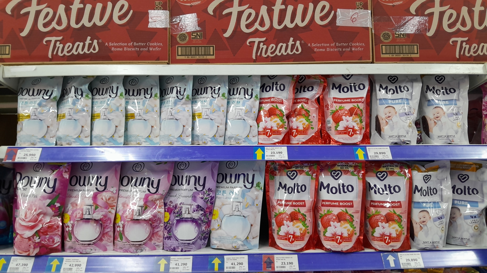
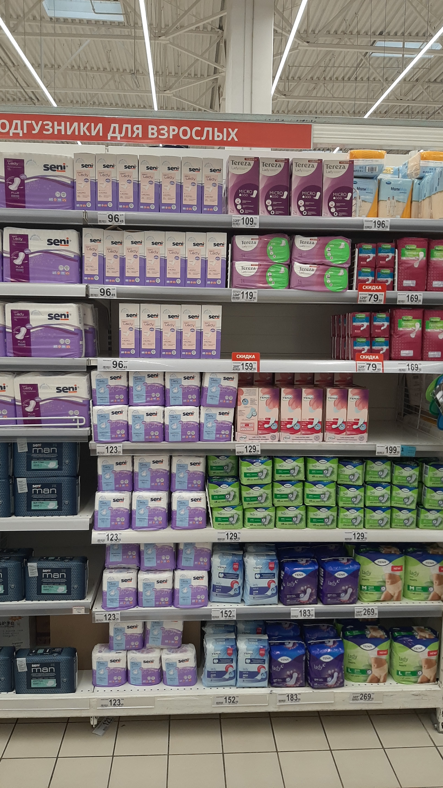

# ShelfSense: Multimodal Retail Shelf Product Detection & Brand Clustering

<p align="center">
  
  
  
  
  
  
  
</p>

> **Documentation Index**:
> - **Setup & Execution Guide**: [`docs/SETUP_GUIDE.md`](docs/SETUP_GUIDE.md) (Docker CPU/GPU modes, local setup, resource specs)
> - **API Specification**: [`docs/API_SPEC.md`](docs/API_SPEC.md) (Endpoint contracts, request/response JSON schemas)
> - **System Architecture**: [`docs/ARCHITECTURE.md`](docs/ARCHITECTURE.md) (Microservice decomposition, data flow)
> - **Technical Write-Up & System Design**: [`docs/WRITEUP.md`](docs/WRITEUP.md) (Deep dive, filtering heuristics, benchmarks, scaling)
> - **Portfolio & Resume Guide**: [`docs/PORTFOLIO_RESUME_GUIDE.md`](docs/PORTFOLIO_RESUME_GUIDE.md) (STAR interview bullets, system design defense)

---

## Overview

**ShelfSense** is an end-to-end, production-grade computer vision pipeline and microservice suite designed for automated retail shelf analysis and planogram compliance:

1. **High-Density Product Localization**: Accurately detects tightly packed items on retail shelves using a custom **YOLO11s** backbone trained on the **SKU-110K** dataset (~11,760 dense retail images).
2. **Tri-Signal Rate-Card Filter**: Removes shelf-edge price tags, promotional stickers, and non-product clutter in $<5\text{ ms}$ via in-process geometric, HSV color, and row-relative heuristics.
3. **Multimodal Dual-Scale Brand Grouping**: Combines **Dual-Scale DINOv2 ViT-S/14 embeddings** (Full Silhouette + Aspect-Ratio Aware Label ROI) with **3D HSV Color Histograms (512-D)** and **Hierarchical Agglomerative Clustering (Average Linkage)** with self-calibrating distance thresholding.
4. **Interactive Dashboard & Share-of-Shelf Analytics**: Renders crisp, color-coded visual overlays with transparent product interiors and computes live brand share-of-shelf percentages directly in the browser.

---

## System Architecture

The pipeline is decomposed into three decoupled, containerized microservices communicating via HTTP REST APIs:


### End-to-End Execution Flow


| Microservice | Technology Stack | Core Responsibility |
|---|---|---|
| **Detector Service** (`:5001`) | YOLO11s-640 (SKU-110K) | Localizes raw product candidates across crowded shelves |
| **Flask Orchestrator** (`:5000`) | Flask, Pillow, HTML5/CSS3 | Pipeline coordination, in-process rate-card filtering, result assembly, Web UI |
| **Grouping Service** (`:5002`) | DINOv2 ViT-S/14, 3D HSV, Agglomerative Linkage | Multimodal feature extraction, adaptive distance calibration, and brand clustering |

---

## Quick Start

### 1. Prerequisites
- **Docker Desktop** (v4.x+ with Docker Compose v2)
- **Model Weights**: `sku110k-yolo11-s640.pt` is stored in `detector_service/weights/` (downloaded automatically on first run from Hugging Face if missing).

### 2. Launch with Docker Compose (Recommended)

```bash
# Standard CPU Mode (Lightweight ~1.5 GB build, works out of the box on any machine)
docker compose up --build -d
```

*(For GPU acceleration with CUDA 12.6, run: `TORCH_INDEX_URL=https://download.pytorch.org/whl/cu126 docker compose up --build -d`)*

### 3. Open Web Dashboard
Navigate to **[http://localhost:5000](http://localhost:5000)** in your browser:
- Drag and drop any shelf image (`.jpg`, `.png`).
- Watch real-time stage progress (`Detection` -> `Filtering` -> `Grouping` -> `Visualization`).
- View color-coded product groups, brand share-of-shelf percentage metrics, and full-resolution lightbox inspection.

---

## Core API Contract

### `POST /api/analyze`
Accepts a retail shelf photograph and returns localized products, assigned brand groups, and annotated visualization URL.

```bash
curl -X POST -F "image=@test_images/128008.jpg" http://localhost:5000/api/analyze
```

**JSON Response (`200 OK`):**
```json
{
  "image_id": "f71d7060ad03",
  "width": 1080,
  "height": 1920,
  "num_products": 31,
  "num_groups": 11,
  "num_filtered_ratecards": 11,
  "model_used": "sku110k-yolo11-s640",
  "visualization_url": "/outputs/f71d7060ad03_viz.jpg",
  "latency_ms": 348.5,
  "detections": [
    {
      "id": 0,
      "box": [349.0, 1331.9, 507.8, 1429.0],
      "det_score": 0.82,
      "group_id": 10
    }
  ]
}
```

---

## Results

### Example 1
<p align="center">
  <b>Before (Raw Image)</b> &nbsp; &nbsp; &nbsp; &nbsp; &nbsp; &nbsp; &nbsp; &nbsp; &nbsp; &nbsp; &nbsp; &nbsp; <b>After (Detection & Clustering)</b><br/>
  
  &nbsp; &nbsp; &nbsp; &nbsp;
  
</p>

* **Products Detected**: 22
* **Brand Groups**: 6
* **Processing Time**: ~800ms 

### Example 2
<p align="center">
  <b>Before (Raw Image)</b> &nbsp; &nbsp; &nbsp; &nbsp; &nbsp; &nbsp; &nbsp; &nbsp; &nbsp; &nbsp; &nbsp; &nbsp; <b>After (Detection & Clustering)</b><br/>
  
  &nbsp; &nbsp; &nbsp; &nbsp;
  
</p>

* **Products Detected**: 115
* **Brand Groups**: 14
* **Processing Time**: ~900ms

---

## Performance Benchmarks

| Metric | CPU Mode (Standard x86/ARM) | GPU Mode (NVIDIA RTX 4060 / CUDA 12.6) |
|---|---|---|
| **End-to-End Latency** | ~6.0 - 8.5 seconds per shelf image | ~800 - 950 ms per shelf image (~8x speedup) |
| **Detection Backbone** | YOLO11s (conf=0.25, iou=0.45, 640px) | YOLO11s (conf=0.25, iou=0.45, 640px) |
| **Filter Overhead** | < 5 ms in-memory | < 5 ms in-memory |
| **Embedding Extraction** | ~1.5 - 2.5 seconds (50 crops, DINOv2 + HSV) | ~120 - 150 ms (50 crops, DINOv2 + HSV) |
| **Clustering Time** | < 5 ms (Average Linkage) | < 5 ms (Average Linkage) |

---

## Scalability & Production Readiness

- **Stateless Microservices**: Independent containers for detection, grouping, and orchestration communicating over HTTP.
- **Horizontal Auto-Scaling**: Downstream services scale independently with Docker Compose:
  ```bash
  docker compose up --scale detector=3 --scale grouping=2 -d
  ```
- **Isolated Compute Architecture**: High-throughput GPU nodes can host detector and grouping workers while lightweight CPU instances host the web orchestrator.

---

## Project Structure

```
shelf_sense_pipeline/
├── docker-compose.yml       <- Multi-service container orchestration
├── .env.example             <- Configurable runtime thresholds
├── README.md                <- Project overview & quickstart
├── LICENSE                  <- MIT Open Source License
├── flask_app/               <- Web UI, API orchestrator & rate-card filtering
├── detector_service/        <- YOLO11s SKU-110K detection microservice
├── grouping_service/        <- Dual-Scale DINOv2 + HSV clustering microservice
├── test_images/             <- Sample retail shelf test images
├── outputs/                 <- Saved annotated output images
└── docs/
    ├── SETUP_GUIDE.md       <- Detailed setup and execution manual
    ├── API_SPEC.md          <- Complete REST API specification
    ├── ARCHITECTURE.md      <- End-to-end architecture & data flow
    ├── WRITEUP.md           <- Technical write-up & system design
    └── PORTFOLIO_RESUME_GUIDE.md <- Resume bullets (STAR) & interview defense
```

---

## License

This project is licensed under the [MIT License](LICENSE).
