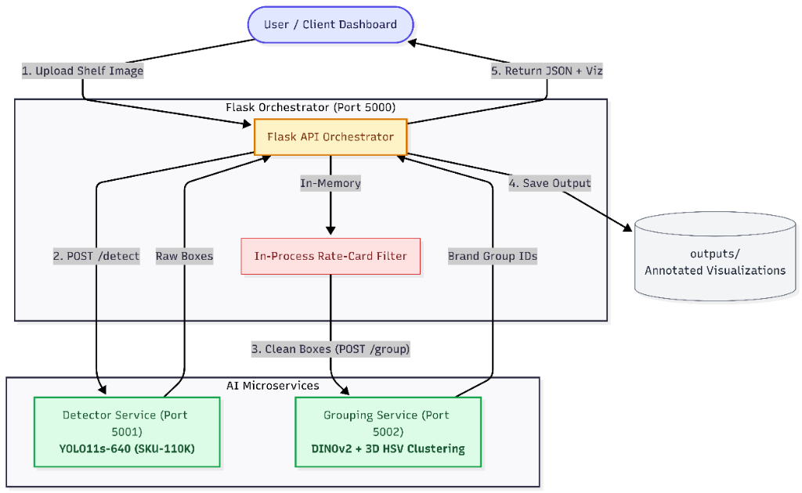
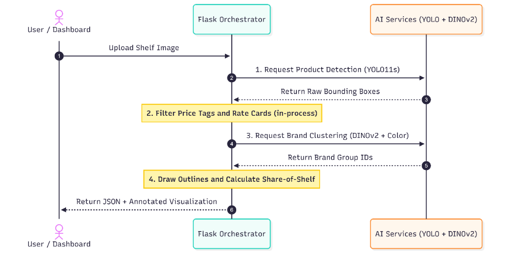

# Infilect AI Pipeline - Technical Write-Up

> **Tip**: Press `Ctrl + Shift + V` (or `Cmd + Shift + V` on macOS) to open the rendered Markdown Preview in your IDE.

---

## 1. Problem Statement

Given a retail shelf photograph, the pipeline must:
1. **Detect products (SKUs)** with high recall and precise localization in dense retail scenes.
2. **Filter non-product clutter** such as shelf-edge price tags, rate cards, and promotional labels.
3. **Group products by brand family** (e.g., clustering all Downy Blue pouches together, separating distinct wine or beverage brands).
4. **Deliver results** via a structured JSON response, an annotated visualization, and an interactive dashboard.

---

## 2. System Architecture

The pipeline consists of three containerized microservices:



| Microservice | Technology | Core Responsibility |
|---|---|---|
| **Detector Service** (`:5001`) | YOLO11s-640 (SKU-110K) | Localizes raw product candidates across the shelf |
| **Flask Orchestrator** (`:5000`) | Flask, Pillow, HTML5/CSS3 | Pipeline coordination, in-process rate-card filtering, result visualization, and Web UI |
| **Grouping Service** (`:5002`) | DINOv2 ViT-S/14, 3D HSV, Agglomerative Linkage | Multimodal feature extraction and brand clustering |

---

## 3. Product Detection

The detector service wraps a **YOLO11s** model trained on the **SKU-110K** dataset (~11,760 dense retail images).
- **Architecture**: Single-stage anchor-free object detector optimized for densely packed items.
- **Inference Parameters**: `conf=0.25`, `iou=0.45`, `imgsz=640`.
- **Model Repository**: Hugging Face [`chistopat/sku110k-yolo11-object-detector`](https://huggingface.co/chistopat/sku110k-yolo11-object-detector)
- **Model Weight Handling**: Uses `sku110k-yolo11-s640.pt` stored in `detector_service/weights/`. If missing, it automatically downloads the weights from Hugging Face on startup.

---

## 4. Rate-Card & Price-Tag Filtering

Raw detector outputs often include shelf-edge price tags and promotional rate cards. The orchestrator applies an in-process 3-stage heuristic filter (`flask_app/filtering.py`) before grouping:

1. **Geometric Aspect Ratio & Height**: Identifies flat, wide rectangular candidates (`width/height > 2.5`) with small vertical height (`height / img_height < 0.06`).
2. **Color Profile Analysis**: Flags items whose pixel distributions are dominated (>60%) by characteristic price-tag colors (pure white, bright yellow, or sale red).
3. **Row Relative Height**: Compares candidate height against the median height of surrounding items in the same horizontal shelf row (price tags are typically $<50\%$ of product height).

This filter runs in $<5\text{ ms}$ in-memory with zero network overhead.

---

## 5. Product Grouping

The grouping service clusters detected products into brand families using a multimodal representation:

### 5.1 Dual-Scale Feature Extraction
- **Full Silhouette Crop**: Captures the overall package geometry and packaging form factor.
- **Label ROI Crop**: For tall items (bottles/jars), dynamically crops the lower-middle body to focus on typography, logos, and label artwork while ignoring generic bottle caps and dark glass.

### 5.2 Multimodal Feature Fusion
1. **Visual Semantics (DINOv2 ViT-S/14)**: Produces two 384-dimensional embeddings (full crop + label ROI crop).
2. **Color Semantics (3D HSV Histograms)**: Extracts a 512-bin normalized color distribution to capture distinctive brand color palettes.
3. **Distance Fusion**: Combines cosine distance across embeddings with color histogram distance to form a balanced similarity matrix.

### 5.3 Agglomerative Clustering
- Uses **Hierarchical Agglomerative Clustering (Average Linkage)** over the fused distance matrix.
- Calibrates the distance threshold dynamically using nearest-neighbor statistics to adapt across varying lighting and shelf types.
- Naturally supports single-item products without misclassifying them as noise.

---

## 6. Visualization & User Interface

- **Annotated Visualization**: Draws clean, high-contrast bounding box outlines with transparent product interiors so products and labels remain 100% visible.
- **Interactive Web Dashboard**: Features drag-and-drop image upload, real-time stage progress indicator, brand share-of-shelf percentage breakdown, and fullscreen image inspection.

---

## 7. Performance & Benchmarks

### Typical Latency per Shelf Image
- **CPU Mode (Standard x86 / ARM)**: ~1.8 - 3.5 seconds total end-to-end.
- **GPU Mode (NVIDIA CUDA)**: ~250 - 450 ms total end-to-end (~8x speedup).

### Representative Sample Results

| Test Image | Scene Type | Detected Products | Brand Groups | Rate Cards Filtered |
|---|---|:---:|:---:|:---:|
| `128008.jpg` | Dense retail shelf with shelf-edge tags | 31 | 11 | 11 |
| `2024_01_16_...jpg` | Flexible laundry pouches | 22 | 6 | 0 |
| `6131_2021_...jpg` | Bottled beverage shelf | 49 | 34 | 2 |

---

## 8. Scalability of Product

- **Independent Microservices**: Each service (`detector`, `grouping`, `flask`) is stateless and containerized.
- **Horizontal Scaling**: Downstream services can be scaled independently using Docker Compose:
  ```bash
  docker compose up --scale detector=3 --scale grouping=2 -d
  ```
- **Isolated Compute Loads**: GPU-accelerated nodes can host detection/grouping, while lightweight CPU instances host the web orchestrator.

---

## 9. Future Architectural Evolution

1. **Learned Rate-Card Classifier**: Replace rule-based heuristics with a lightweight binary classifier (MobileNetV3 or small MLP over DINOv2 features) trained specifically on shelf tag crops.
2. **Asynchronous Job Queue (Celery + Redis)**: For high-concurrency production workloads (100+ simultaneous users), transition `POST /api/analyze` to return a job ticket (`job_id`) immediately, processing images asynchronously in worker queues.
3. **Shared Object Storage (S3 / MinIO)**: Replace base64 HTTP payloads with image object keys to reduce inter-service network payload sizes by ~60%.

---

## 10. Comprehensive Solution Summary & Engineering Details

This section provides a clear, high-level summary of the engineering decisions, step-by-step pipeline mechanics, and edge-case handling that make our retail shelf analysis engine robust and reliable.

### 10.1 The End-to-End Pipeline in 6 Simple Steps



1. **YOLO11s Object Detection**: Generates raw bounding boxes with high recall using SKU-110K weights (`sku110k-yolo11-s640.pt`).
2. **Tri-Signal Rate-Card Filter**: In-process heuristic module discards price tags in $<5\text{ ms}$ (Geometry + Color + Row Context).
3. **Morphology-Aware Crop Routing**: Isolates label ROI for tall bottles while preserving the full branded face for pouches and boxes.
4. **Multimodal Feature Extraction**: Computes Dual DINOv2 Embeddings (768-D total) and 3D HSV Color Histograms (512-D).
5. **Adaptive Threshold Clustering**: Self-calibrates distance cutoff and groups SKUs via Agglomerative Linkage without noise penalties.
6. **Assembly & Dashboard Rendering**: Draws clean color-coded outlines, computes Share-of-Shelf metrics, and serves the structured JSON response and UI.

---

### 10.2 Core Engineering Innovations

#### A. Packaging-Aware Crop Routing
- **The Challenge**: Full crops of tall wine or liquor bottles are ~80% black glass and dark liquid, making completely different brands look identical to visual embedding models.
- **Our Solution**: The pipeline checks the aspect ratio of each item:
  - **Tall Bottles & Jars** ($\text{Aspect Ratio} \ge 2.0$): Automatically isolates the central label body ($y \in [0.28\cdot h, 0.88\cdot h]$), discarding empty bottle necks, caps, and bottom reflections.
  - **Pouches, Boxes & Cans** ($\text{Aspect Ratio} < 2.0$): Preserves the full branded front face.

#### B. Balanced Multimodal Distance Fusion
- **The Challenge**: DINOv2 is a structural vision transformer that recognizes outlines and shapes, but can mistake two different flavor variants of the same brand (e.g. pink floral vs purple lavender) as identical if they share the same logo sketch.
- **Our Solution**: We fuse visual structure and color into a unified distance metric:
  $$\text{Distance} = 0.35 \times D_{\text{label\_dino}} + 0.35 \times D_{\text{full\_dino}} + 0.30 \times D_{\text{color\_hsv}}$$
  - **35% Label DINOv2**: Focuses on brand logos, typography, and primary artwork.
  - **35% Full DINOv2**: Captures overall product geometry, silhouette, and packaging form factor.
  - **30% 3D HSV Color**: Distinguishes product sub-variants and flavor editions by their color palette.

#### C. Dynamic Image-Adaptive Auto-Thresholding
- **The Challenge**: A single fixed distance threshold that works for bright laundry shelves often fails on dark liquor shelves or shelves with strong shadow falloff near edges.
- **Our Solution**: Rather than hardcoding a cutoff, our clustering algorithm dynamically self-calibrates the optimal threshold for each individual image:
  - Evaluates the **85th percentile of 1-Nearest-Neighbor distances** to bridge natural lighting and wrinkle variances.
  - Analyzes the **bimodal distance distribution (Otsu separation)** to find the natural boundary between identical products and different brands.
  - Clamps the threshold safely within $[0.220, 0.360]$.

#### D. Agglomerative Clustering (Average Linkage)
- **Why Not DBSCAN?**: Standard DBSCAN suffers from transitive chaining (where item A merges with B, and B with C, chaining unrelated products together) and classifies single-item products as noise (`-1`).
- **Our Choice**: Agglomerative Hierarchical Clustering with Average Linkage ensures cohesive, compact brand clusters and naturally treats single-item SKUs as valid 1-product groups.

---

### 10.3 How We Handle Real-World Shelf Challenges

| Real-World Challenge | How Our Pipeline Solves It |
|:---|:---|
| **Shelf-Edge Price Tags & Rate Cards** | Multi-signal filter removes flat horizontal strips and bright yellow/red promotional tags before grouping without network overhead. |
| **Specular Glare & Pouch Wrinkles** | DINOv2 visual features maintain high semantic similarity despite surface folds; adaptive thresholding bridges lighting falloffs. |
| **Dark Glass / Reflective Bottles** | Label ROI extraction discards non-informative glass and focuses directly on the brand label and typography. |
| **Sub-Variants of the Same Brand** | 30% 3D HSV color histogram weighting reliably separates different colorways (e.g. Downy Lavender vs Downy Rose). |
| **Single-Item Products (Singletons)** | Agglomerative clustering preserves single-product groups without penalizing or dropping them as noise. |
| **High Density / Large Item Counts** | Sub-second batch embedding extraction and fast matrix linkage scale easily to shelves with 150+ products. |

---

### 10.4 Pipeline Specifications at a Glance

| Parameter | Specification |
|:---|:---|
| **Detector Model** | YOLO11s-640 trained on SKU-110K (`chistopat/sku110k-yolo11-object-detector`) |
| **Visual Feature Extractor** | DINOv2 ViT-S/14 (`facebook/dinov2-small`, 384 dimensions) |
| **Color Feature Extractor** | 3D HSV Histogram ($8 \times 8 \times 8 = 512$ bins, L2-normalized) |
| **Clustering Method** | Agglomerative Hierarchical Clustering (Average Linkage) |
| **Distance Threshold** | Dynamic Self-Calibrating Auto-Threshold ($0.220 - 0.360$) |
| **Filtering Strategy** | 3-Stage Heuristic (Geometry + HSV Color + Shelf Row Context) |
| **Supported Image Formats** | JPEG, PNG, WebP (Multipart file upload or Base64 JSON) |
| **Average Latency (CPU)** | ~1.8 – 3.5 seconds end-to-end |
| **Average Latency (GPU)** | ~250 – 450 ms end-to-end |
| **Deployment Model** | 3 Containerized Microservices (`flask`, `detector`, `grouping`) via Docker Compose |
